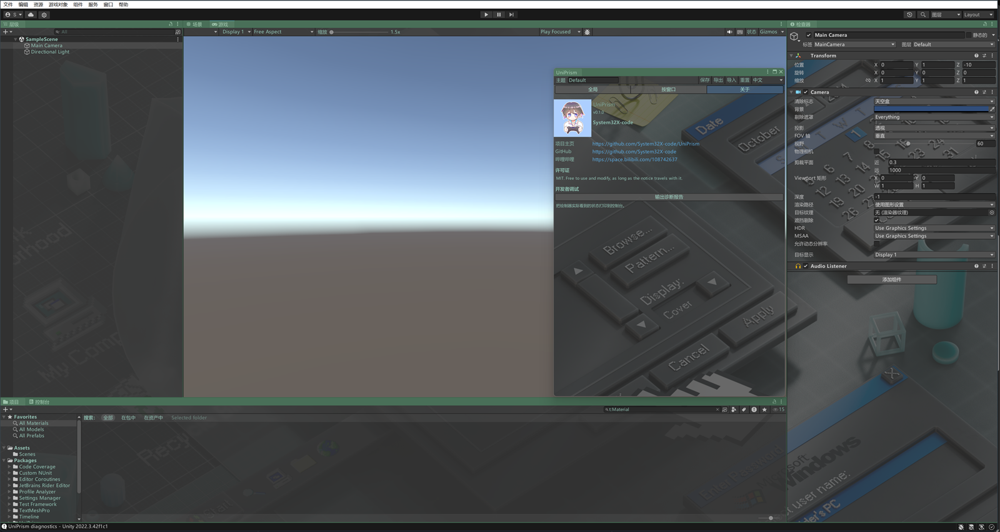

<div align="center">

# UniPrism

**Unity エディターのウィンドウごとに背景画像とカラーを設定する**

[](https://unity.com/releases/editor/qa/lts-releases?version=2022.3)
[](LICENSE)
[](#インターフェースの言語)

[简体中文](README.md) · [English](README-EN.md) · 日本語



</div>

---

## 概要

UniPrism は Unity エディターの見た目を変更するツールです。エディター全体に壁紙を敷いたり、ウィンドウごとに色調を変えたり、テキストの色を好みに合わせたりできます。設定はテーマとして保存され、プロジェクトや Unity のバージョンをまたいでマシンに追従します。単一ファイルとしてエクスポートして共有することもできます。

外部依存はなく、Unity のインストール先も変更しません。

## 機能

**背景**

- ウィンドウごとの背景画像、または**エディター全体に1枚の画像**。各ウィンドウはその背後にあたる部分だけを表示するため、全体で1枚の連続した絵になります。ウィンドウごとに縮小した複製が並ぶことはありません
- 構図の調整: 切り抜き / 全体を表示 / 引き伸ばし、ズームと位置、**リアルタイムプレビュー付き**
- 画像はディスクから直接選択でき、プロジェクトへのインポートも、インポーターによる圧縮やサイズ上限も経由しません

**カラー**

- 3色のパレット。ウィンドウは色をコピーせずパレットの色を参照するため、パレットを1色変えるだけで参照先すべてがまとめて変わります
- 独立して色を付けられる3つの領域: **ウィンドウの背景パネル**、**テキスト**（アイコンを含めるかは選択可）、**ウィンドウの枠**（ドックのタブ帯）
- テキストへの色付けは、既定でアイコンに影響しません

**構成**

- グローバル設定がすべてのウィンドウに適用され、個々のウィンドウは背景・カラーを個別に上書きできます
- テーマはエディターの preferences フォルダーに保存されプロジェクトをまたいで有効です。画像を内包した `.prism` ファイルとしてエクスポートできます
- インターフェースは 中文 / English / 日本語 に対応

## インストール

Package Manager → **+** → **Add package from git URL**:

```
https://github.com/System32X-code/UniPrism.git
```

または `Packages/manifest.json` の `dependencies` に追加します:

```json
"com.system32x.uniprism": "https://github.com/System32X-code/UniPrism.git"
```

## 使い方

**Window → UniPrism** を開きます。ページは3つあります。

### グローバル

すべてのウィンドウの基準となる設定です。

| 設定 | 内容 |
|---|---|
| パレット | プライマリ / セカンダリ / ターシャリ。以下の「カラーの参照元」でパレットを選ぶと、その色に追従します |
| 画像 | 背景画像。「参照...」でディスクから選択、「調整...」で切り抜きを調整 |
| エディター全体に1枚の画像 | すべてのウィンドウが1枚の連続した絵を共有します |
| ウィンドウの背景パネル | 不透明度を下げるとウィンドウ自身のパネルが薄くなり、画像が透けて見えます |
| テキスト | 別系統で色付けされ、「アイコンも色付け」を有効にしない限りアイコンには影響しません |
| ウィンドウの枠 | ドックのタブ帯と枠線 |

### ウィンドウ別

対象のウィンドウを選び、グローバル設定から外れるかどうかを2つのスイッチで決めます。

- **グローバルの背景を上書き**
- **グローバルのカラーを上書き**

どちらもオフであれば、そのウィンドウはグローバル設定に従います。コントラストを付けたい場合は、一部のウィンドウをプライマリに、別の一部をターシャリに割り当てるとよいでしょう。

### 情報

作者とプロジェクトのリンク、および「開発者向け → 診断レポートを出力」があります。ペインターが実際に認識している状態をコンソールに書き出します。**不具合を疑う前にまずこれを実行してください。** フックの有無、ウィンドウ名の一致、画像のデコード可否が確認できます。

## 仕組み

UniPrism は、ホストビューがウィンドウを描画するために呼び出すデリゲートをラップします。ここが唯一利用できる継ぎ目です。ホストは不透明なタブ帯と枠をすでに描き終えており、ウィンドウはまだ内容を描いておらず、さらに `ResetGUIState` を通過した後だからです。`ResetGUIState` はホストの OnGUI の最初の1文で GUI のカラーをすべてリセットするため、それより外側で設定した状態は破棄されてしまいます。

色は、スタイルを書き換えるのではなく描画時の色調補正で適用しています。

| チャンネル | 影響範囲 |
|---|---|
| `GUI.backgroundColor` | スタイルの背景パネル。アルファを下げると薄くなり画像が透けます |
| `GUIStyle.textColor` | テキスト。アイコンはこのフィールドを参照しないため、テキストだけに色を付けられます |
| `GUI.contentColor` | テキストとアイコンの両方。「アイコンも色付け」を有効にした場合のみ使用します |

記録しておく価値のある発見があります。現行の Unity では、スタイルの `background` フィールドは**すでに描画を制御していません**。値は書き込めますし、再描画の間ずっと保持され、しかも Unity の IMGUI デバッガーが「描画に使われた」と示すオブジェクト自体に書いても、エディターは元の見た目のまま描画します。一方 `textColor` は現在も読み取られています。両者を同一視することはできません。

Unity が公開していない3つの要素——ホストビューの列挙、ホストが表示しているウィンドウ、描画に使われるデリゲート——はすべて [`HostViewBridge`](Editor/Painting/HostViewBridge.cs) に閉じ込められており、失敗時は静かに機能を停止します。将来の Unity で名前が変わった場合、毎フレーム例外を投げるのではなく、どのメンバーを解決できなかったかを診断で報告した上で動作を止めます。

## 既知の制限

- **粒度はウィンドウ単位であり、コントロール単位ではありません。** あるラベルだけを赤くして隣のボタンをそのままにする、といったことはできません。これは Unity が現在も反映する範囲の限界であり、未完成の機能ではありません。
- **枠は色調補正ではなく上から重ねているため**、タブのラベルも一緒に色が付きます。タブ帯はドック側が描画しており、その間に色調補正を挟む余地がないためです。強さは 0.2〜0.4 程度が自然です。
- **メインウィンドウの最も外側の隙間には手が届きません。** `SplitView` と `MainView` は1ピクセルも描画しません。あの部分はコンテナウィンドウ自身の背景であり、IMGUI 側に描いているコードが存在しません。
- **フローティングウィンドウをタイトルバーでドラッグしている間は背景が追従しません。** その間はビットマップを OS が移動させており、Unity は描画していないためです。スプリッターのドラッグやドッキング状態でのサイズ変更はリアルタイムに追従します。

## 動作環境

- Unity **2022.3+**
- **2022.3.42f1c1** で検証済み

UniPrism は Unity の内部 API を使用しています。依存は可能な限り小さく（3メンバー、1ファイルに集約）抑えていますが、メジャーバージョンの更新で動作しなくなる可能性は残ります。その場合は静かに停止し、理由を報告します。

## インターフェースの言語

ツールバー右側のドロップダウンで **中文 / English / 日本語** を切り替えられます。選択内容は `EditorPrefs` に保存され、初回はシステムの言語に従います。

## コントリビューション

Issue および Pull request を歓迎します。

日本語と英語の文章は非ネイティブによるものです。不自然な表現があればご指摘いただけると助かります。

## 謝辞

UniPrism は [piti6/UniSkin](https://github.com/piti6/UniSkin) の調査から生まれました。同プロジェクトは Unity 2021.2+ では動作しなくなっています。UniPrism の仕組みはまったく異なり、コードも書き直したものですが、最初の方向性といくつかの重要な発見はその調査から得られたものです。

## ライセンス

[MIT](LICENSE)
